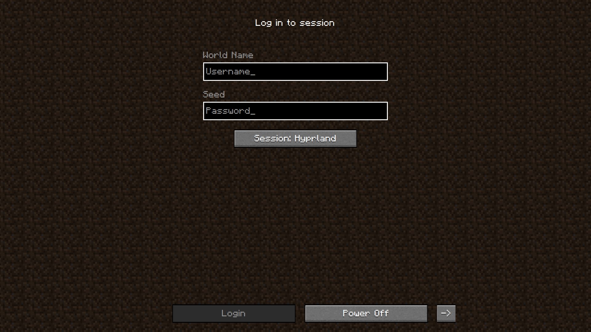
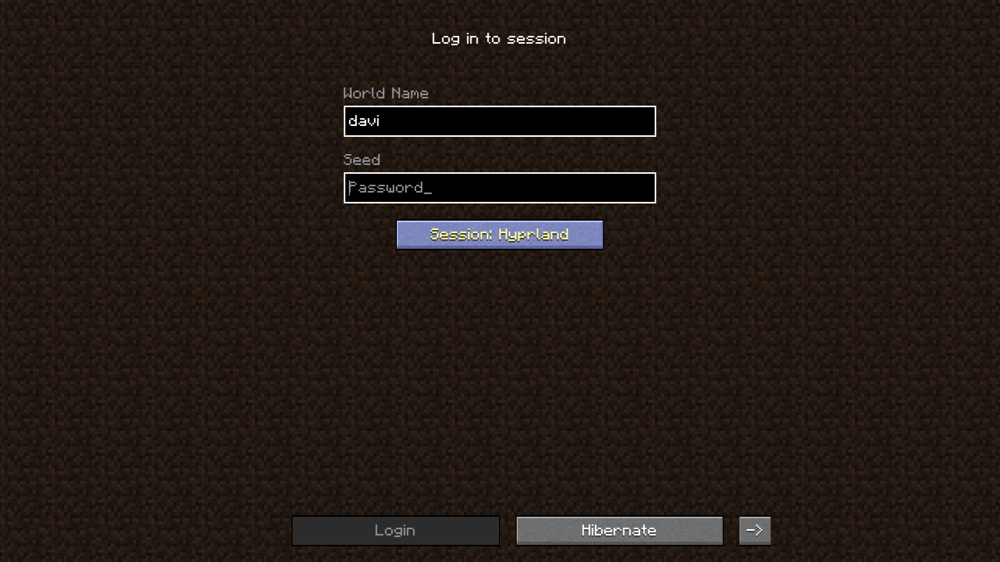
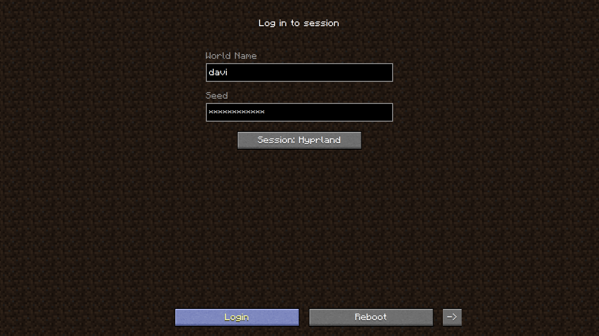
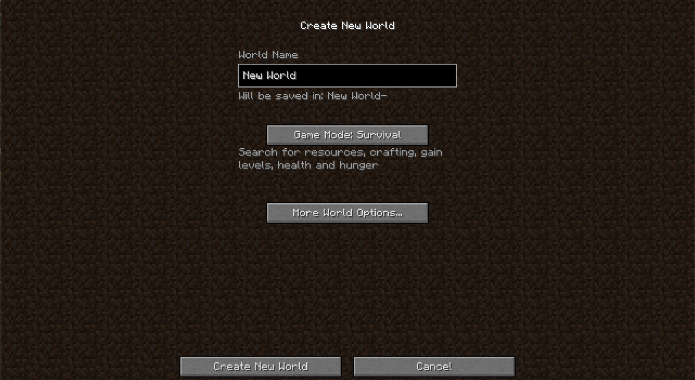
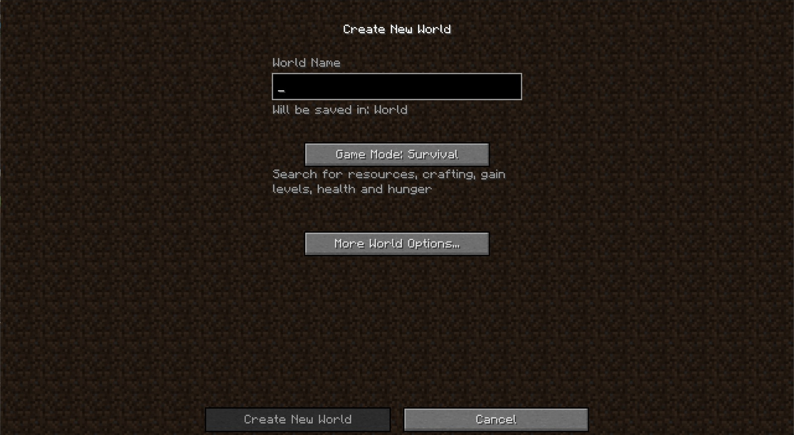
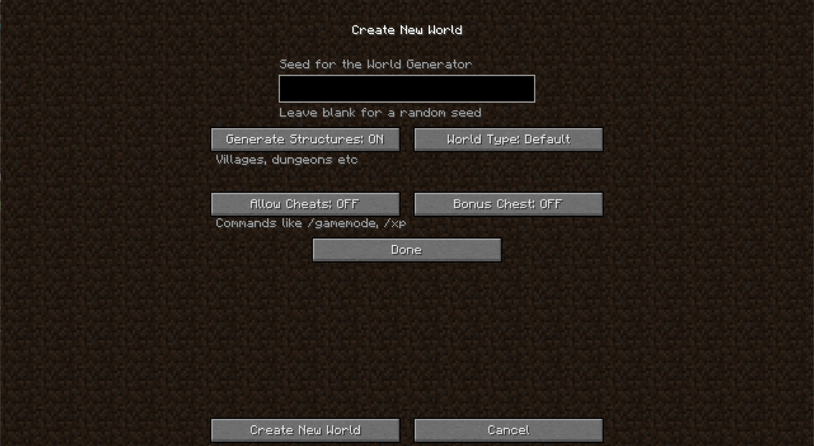

# minesddm Theme

minesddm is a custom theme for [SDDM](https://wiki.archlinux.org/title/SDDM) (Simple Desktop Display Manager) inspired by Minecraft’s retro 1.8 version.

---

## Installation

### Prerequisites

- **SDDM**: Ensure that SDDM is installed and set as your system’s display manager.
- **Qt**: Requires Qt 5.15 or later.
- **Dependencies**: Confirm that your system supports QML and necessary libraries.

### Steps

1. **Clone the Repository**:
   ```bash
   git clone https://github.com/Davi-S/sddm-theme-minesddm.git ~/sddm-theme-minesddm
   ```

2. **Copy the Theme Folder**:
   ```bash
   sudo cp -r ~/sddm-theme-minesddm/minesddm /usr/share/sddm/themes/
   ```

3. **Set the Theme in SDDM**:
   Edit the SDDM configuration file (usually located at `/etc/sddm.conf` or `/etc/sddm.conf.d/default.conf`):
   ```ini
   [Theme]
   Current=minesddm
   ```

3. **Logout of your session**:
   Logout and you will (probably) see the new theme

---

## Customization

### Theme Configuration

Modify the `theme.conf` file to adjust the appearance and behavior of the theme. There are many options for you to adjust as you like

---

## Screenshots

### minesddm




### Minecraft




---

## License

This project is licensed under the [GNU Affero General Public License v3.0](LICENSE).

---

## Contributions

Contributions are welcome! Feel free to open issues or submit pull requests to improve this project.

---

## Acknowledgments

- Inspired by Minecraft’s iconic design and by the [minegrub](https://github.com/Lxtharia/minegrub-theme) grub theme.

---
